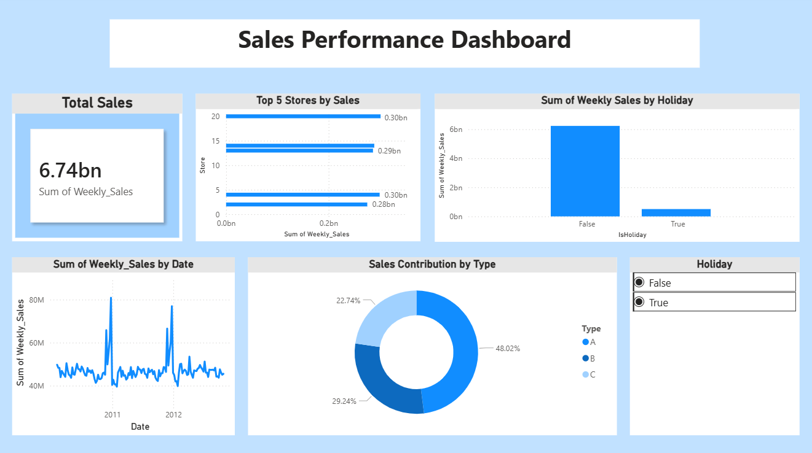

# 📊 Sales Performance Dashboard (Power BI)

## 📌 Project Overview
This project showcases a Sales Performance Dashboard built using Power BI.  
It focuses on analyzing sales trends, store performance, and holiday impact on sales.

## 📊 Key Features
- Total sales analysis  
- Weekly sales trend  
- Top-performing stores  
- Sales by store type  
- Holiday vs non-holiday comparison  

## 🛠 Tools Used
- Power BI  
- Power Query  
- Data Modeling  

## 📷 Dashboard Preview

## 📌 Insights
- Type A stores contribute the highest sales  
- A few stores drive majority of revenue  
- Sales patterns vary during holiday periods  

## 🚀 Future Improvements
- Add regional analysis  
- Add advanced KPIs  
- Improve dashboard design  
